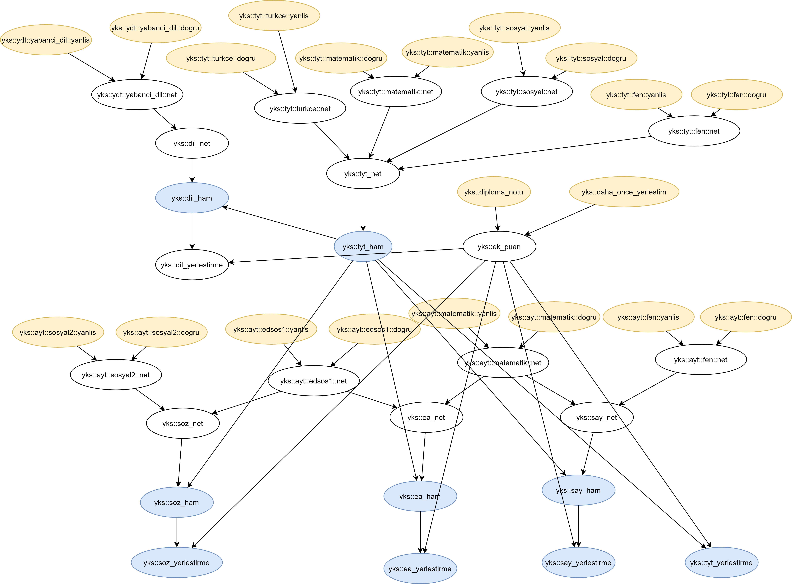

# AutoCompute

A tiny domain-specific language for automatically calculating deducible outputs from given inputs and constraints.

Given declarations of inputs and output definitions depending on those inputs or other outputs, supplying values for any arbitrary number of inputs will yield the values of outputs that can be inferred.

A simple example would be:
```
entity sample {
    // Input declarations for this system of computation named "sample"
    in x.
    in y.
    in z.

    // An intermediate variable
    v := y * 2.
    
    // Output definitions
    out a := x + v.
    out b := z * 10.0.
    out c := x * 3 + z * 10.
}

/*  
Compute call for the entity "sample". 
This will output what can be inferred from those inputs. 
*/
compute sample {
    x << 5.
    y << 10.
}.
```
This will yield:
```
sample::a = 25.000000.
```
Because only output `a` can be computed from those set of input definitions.

### Concepts
Below are some of the concepts in this tiny language.
#### Entities
Any input output system is structured via entities. With `entity` keyword, a named static scope can be defined, in which inputs, intermediate variables, and outputs can be declared and defined. Entities can also be nested.

#### Inputs
The keyword `in` declares the input that can be fed to that entity during a `compute` call.

#### Outputs and intermediate variables
The keyword `out` defines the output variable that will be the end goal of computation after a `compute` call. There's no keyword for defining the type of intermediate variables, as every variable is internally represented as floating-point numbers. There's also no separation of declaration and definition, you can only define an intermediate variable, same as outputs.

#### Constraints
Any number of constraints can be set on the computation of a variable using the keyword `given` after the expression that defines the variable. For example:
```
out c := x * 3 + z * 10 given { z > 5, "The variable z must be greater than 5". }.
```
If the constraint can't be satisfied during execution, the output will include:
```
sample::c = NaN, "The variable z must be greater than 5".
```
giving the reason. 

If too many calculations depends on the same set of constraints, they can be defined only once, before the inputs, using `constraints` keyword:
```
constraints z_constraint { 
    z > 5, "The variable z must be greater than 5". 
}.
...
out c := x * 3 + z * 10 given z_constraint.
```
This will create a scope that will be dynamically binded to the scope of the output computation, so the name `z` will be resolved dynamically depending on the context.

#### Types
Variables inside an `entity` are internally represented by floating-point numbers. In the language side however, there are only 2 types, boolean and numeric. There's no type declaration for these two types, they are inferred during abstract syntax tree construction. Boolean types are interpreted as either 0s or 1s.

### Grammar
[The grammar](grammar/AutoCompute.g4), as well as lexer and parser are constructed using [ANTLR](https://www.antlr.org/).

## Use cases
I'm not entirely sure which other problems can this be used to solve efficiently, but I needed this kind of system of dynamic computation involving dependency relations for my mobile application for standardized test score tracking. The application aims to provide assistance to the students preparing for university entrance exam (YKS) in Turkey, but because the exam system regularly changes once in a few years, I needed a system in which I could substitute those changes without invasive code changes involving thousands of lines of code. This need -although could be solved very easily with a simple JSON schema rather than a DSL with a working interpreter- fused with my desire to learn and see some concepts in the practice of programming language implementation by actually creating one.

To be more concrete, here is the dependency graph of the score types in university entrance exam in Turkey:



Yellow nodes represent the actual outcome (number of correct and false answers) of each test, blue nodes represent the score types. As can be seen from above, some scores do not depend on some inputs, hence, only deducible outputs are calculated from given inputs.

These sets of computations can be represented by the following AutoCompute script:

```
entity yks {
    constraints test_20_constraint_set  {
        dogru >= 0 && dogru <= 20, "Doğru sayısı en az 0 en çok 20 olabilir".
        yanlis >= 0 && yanlis <= 20, "Yanlış sayısı en az 0 en çok 20 olabilir".
        dogru + yanlis <= 20, "Doğru ve yanlış sayısının toplamı en fazla 20 olabilir".
    }.

    constraints test_40_constraint_set {
        dogru >= 0 && dogru <= 40, "Doğru sayısı en az 0 en çok 40 olabilir".
        yanlis >= 0 && yanlis <= 40, "Yanlış sayısı en az 0 en çok 40 olabilir".
        dogru + yanlis <= 40, "Doğru ve yanlış sayısının toplamı en fazla 40 olabilir".
    }.

    constraints test_80_constraint_set  {
        dogru >= 0 && dogru <= 80, "Doğru sayısı en az 0 en çok 80 olabilir".
        yanlis >= 0 && yanlis <= 80, "Yanlış sayısı en az 0 en çok 80 olabilir".
        dogru + yanlis <= 80, "Doğru ve yanlış sayısının toplamı en fazla 80 olabilir".
    }.


    in diploma_notu.
    in daha_once_yerlesti.

    ek_puan := (diploma_notu * 5.0) * (daha_once_yerlesti ? 0.06 : 0.12) given {
        diploma_notu >= 50.0 && diploma_notu <= 100, "Diploma notu en az 50 en fazla 100 olabilir!".
    }.

    entity tyt {
        entity turkce {
            in dogru.
            in yanlis.

            out net := dogru - yanlis * 0.25 given test_40_constraint_set.
        }

        entity matematik {
            in dogru.
            in yanlis.

            out net := dogru - yanlis * 0.25 given test_40_constraint_set.
        }

        entity fen {
            in dogru.
            in yanlis.

            out net :=  dogru - yanlis * 0.25 given test_20_constraint_set.
        }

        entity sosyal {
            in dogru.
            in yanlis.

            out net := dogru - yanlis * 0.25 given test_20_constraint_set.
        }

        out net := turkce::net + matematik::net + sosyal::net + fen::net
            given {
                turkce::net >= 0.5 && matematik::net >= 0.5.
            }.
    }

    entity ayt {
        entity edsos1 {
            in dogru.
            in yanlis.

            out net := dogru - yanlis * 0.25 given test_40_constraint_set.

        }

        entity sosyal2 {
            in dogru.
            in yanlis.

            out  net := dogru - yanlis * 0.25 given test_40_constraint_set.
        }

        entity matematik {
            in dogru.
            in yanlis.

            out  net := dogru - yanlis * 0.25  given test_40_constraint_set.
        }

        entity fen {
            in dogru.
            in yanlis.

            out  net := dogru - yanlis * 0.25  given test_40_constraint_set.
        }

    }

    entity ydt {
        entity yabanci_dil {
            in dogru.
            in yanlis.

            out net := dogru - yanlis * 0.25  given test_80_constraint_set.
        }
    }

    out say_net := ayt::matematik::net + ayt::fen::net      given { ayt::matematik::net >= 0.5 && ayt::fen::net     >= 0.5. }.
    out ea_net  := ayt::matematik::net + ayt::edsos1::net   given { ayt::matematik::net >= 0.5 && ayt::edsos1::net  >= 0.5. }.
    out soz_net := ayt::edsos1::net    + ayt::sosyal2::net  given { ayt::edsos1::net    >= 0.5 && ayt::sosyal2::net >= 0.5. }.
    out dil_net := ydt::yabanci_dil::net                    given { ydt::yabanci_dil::net >= 0.5. }.

    // Normally, these set of outputs are calculated using mean and standard deviation of scores of test takers,
    // but for simplicity I am emitting them.
    out tyt_ham := 100.0 + (tyt::net * 400.0 / 120.0).
    out say_ham := ((tyt_ham - 100.0) * 0.4 + (say_net * 5.0) * 0.6) + 100.0.
    out ea_ham  := ((tyt_ham - 100.0) * 0.4 + (ea_net * 5.0) * 0.6) + 100.0.
    out soz_ham := ((tyt_ham - 100.0) * 0.4 + (soz_net * 5.0) * 0.6) + 100.0.
    out dil_ham := ((tyt_ham - 100.0) * 0.4 + (dil_net * 5.0) * 0.6) + 100.0.

    out tyt_yerlestirme := tyt_ham + ek_puan.
    out say_yerlestirme := say_ham + ek_puan.
    out ea_yerlestirme := ea_ham + ek_puan.
    out soz_yerlestirme := soz_ham + ek_puan.
    out dil_yerlestirme := dil_ham + ek_puan.
}
```
So that different inputs cause different score types to be calculated. These input declarations and output definitions will internally form computational graphs (expressions) and dependency graphs (references) in the interpreter, and once a compute call is executed, they will be used to compute the possible outcomes.
For example, this:
```
compute yks {
    tyt::turkce::dogru       << 35.
    tyt::turkce::yanlis      << 3.
    tyt::matematik::dogru    << 31.
    tyt::matematik::yanlis   << 1.
    tyt::sosyal::dogru       << 15.
    tyt::sosyal::yanlis      << 3.
    tyt::fen::dogru          << 19.
    tyt::fen::yanlis         << 0.
    diploma_notu             << 83.35.
    daha_once_yerlesti       << false.  
 }.
```
will yield this:
```
yks::tyt::turkce::net = 34.250000.
yks::tyt::matematik::net = 30.750000.
yks::tyt::sosyal::net = 14.250000.
yks::tyt::fen::net = 19.000000.
yks::tyt::net = 98.250000.
yks::tyt_ham = 427.500000.
yks::tyt_yerlestirme = 477.510000.
```

## Usage
You can either use the [JAR file](dist/AutoCompute.jar), and execute the following in command line:
```
java -jar AutoCompute.jar sample.ac
```
with `sample.ac` being the script file, or you can include the runtime as a dependency in your gradle project:
```
dependencies {
    implementation 'com.github.shamilatesoglu:AutoCompute:1.0.0'
}
```
although I haven't tested the latter.

## License

[MIT License](/LICENSE)
